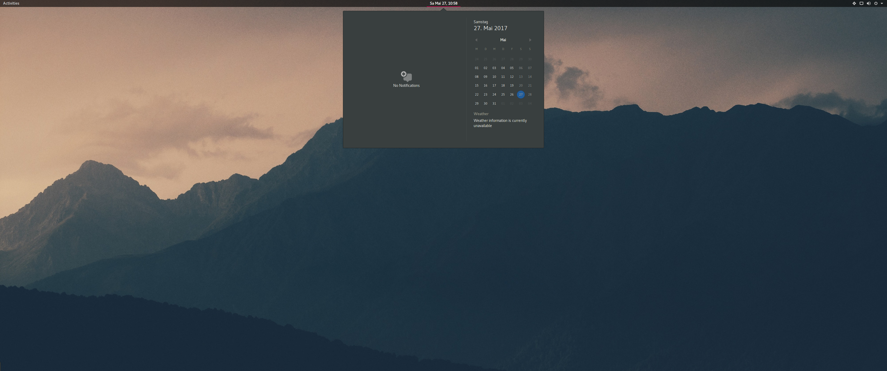
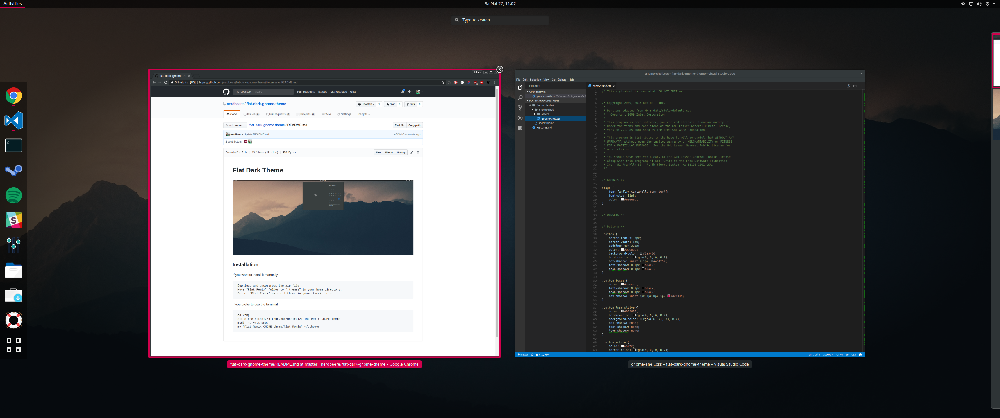

# Flat Dark Theme





## Installation

**If you want to install it manually:**

- Download and uncompress the zip file.
- Move `flat-dark` to your `.themes` directory in your home directory.
  If the directory `.themes` does not exist create it.
- Select "Flat Dark" as shell theme in gnomes Tweak Tool.

**If you prefer to use the terminal:**

```
cd /tmp
git clone https://github.com/nerdbeere/flat-dark-gnome-theme
mkdir -p ~/.themes
mv flat-dark-gnome-theme/flat-dark ~/.themes
```

## Credits

Big shout out goes to [https://github.com/daniruiz](daniruiz) who build [https://github.com/daniruiz/Flat-Remix-GNOME-theme](Flat-Remix-GNOME-theme) from which I got the inspiration for this theme.
